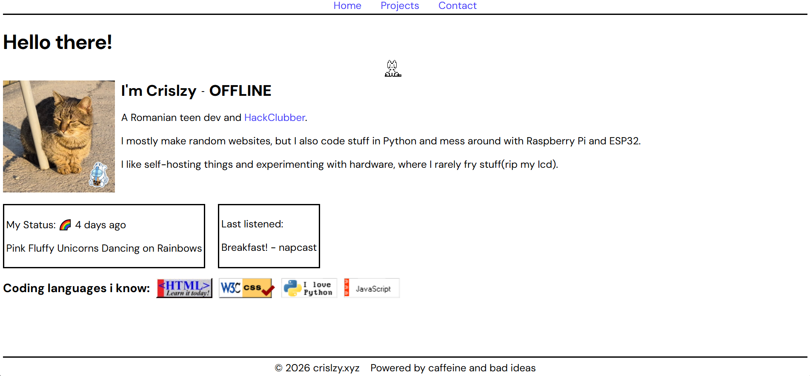

<h1 align="center">CrisLzy's Portfolio</h1>

<i>The source code for v2.crislzy.xyz</i>

## About
This is my really cool portfolio website. It's still work in progress so not all pages might work and there may be bugs.

This is a fully static website using APIs like:
- biancarosa's LastFM API
- Status.Cafe API
- lanyard.rest's Discord Status API

The oneko cat code is from [https://www.cssscript.com/demo/cat-follow-cursor-oneko](https://www.cssscript.com/demo/cat-follow-cursor-oneko)

Also , I kind of learned more js from making this project :)

## Preview

## Todo

- [X] Blog page
- [X] Working Projects and Contact pages
